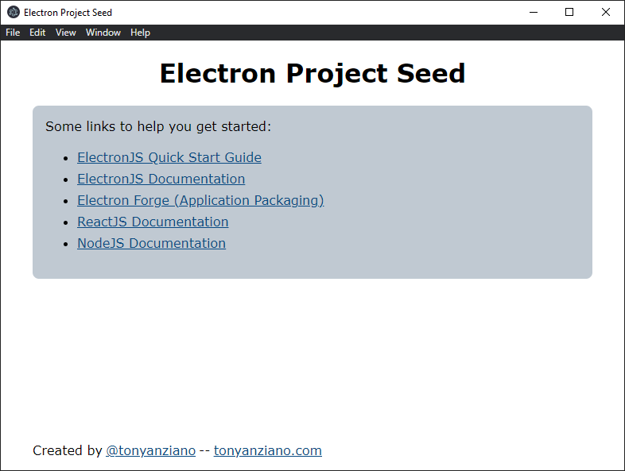

# Electron Project Seed

This is a minimum working sample of an ElectronJS project with some modern web and JS technologies already configured:

- Electron 12.x.x
- React 17.x.x
- Typescript 4.2.4
- Webpack 5.x.x

If you want to whip up a quick testing environment to try an idea out, or you want to start up a new project, just clone this repository and you're good to go.

# How to Run

1. `yarn` or `npm install`
2. `yarn build` or `npm build`
3. `yarn start` or `npm start`
